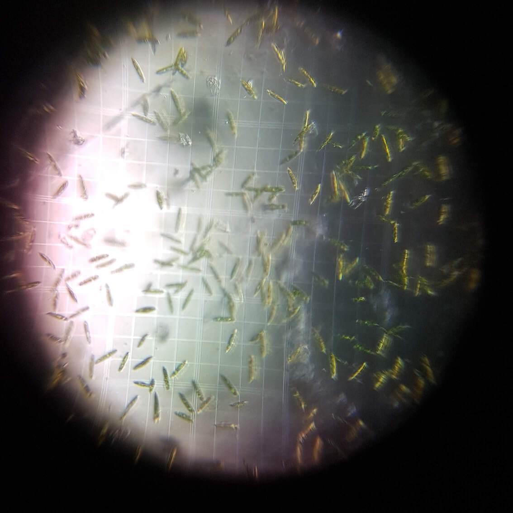

# ProtestsForProtists

Instructions and makefiles for the [ProtestsForProtists](https://lpoolmakefest.org/portfolio/domestic-science-protests-for-protists/) event by [Domestic Science](https://domesticscience.org.uk)

Armed with DIY microscopes count up hidden micro-organisms to protest against bio-diversity collapse in the back of your kitchen cupboard!

Learn how to count micro-organism populations and use your camera phone to take and tweet pictures of micro-organisms like yeast and Euglena gracis; a space to talk about bio-diversity at all scales of biological life.

Streaming as and when wifi allows on the [CriticalKits Twitch Stream](https://twitch.tv/criticalkits)

### Requirements

 * DoES Microscope with 3D printed Adaptor for PiCam v.2.1
 * PiZero + PiCam
 * [MakeSpace Live Setup](https://github.com/DynamicDevices/makespacelive)
 * [FoldScope](https://www.foldscope.com/) or other popular [DIY Microscopes](https://civiclaboratory.nl/2016/08/06/diy-microscopes/)
 * Super lofi Microscope; water droplet near a phone camera; a foldscope kit hack, example [here](https://hackteria.org/wiki/Mobile_Phone_Field_Microscope#The_ultra-simple_droplet-PhoneScope)
 * [Hackteria Microscope Stage](https://publiclab.org/notes/partsandcrafts/01-22-2018/building-the-microscope-stage)
 * Protesting Protist Score Sheet
 * Instructions for activity

### Slide Types

|Slide type|Useage & Metaphors
|---|---
|[Hemocytometer](https://en.wikipedia.org/wiki/Hemocytometer)|For serious protist and bacterial colony counting. Limited access in workshop as it interferes with the protesting streets conceit. Signposts to actual science practices.
|Ranging Slide|Get to scale in a serious way. Build microscopic reality consistently.
|[Vinyl cut](https://github.com/DoESLiverpool/somebody-should/wiki/HarryPlotterVinylCutter) Street Models & [Agarose](https://www.ebay.co.uk/itm/Agarose-For-Agarose-Gel-DNA-RNA-Electrophoresis-UltraPure-Quick-Dissolve-Agarose/130944677475)|Simple millifluidic streets and town squares for protesting protists. Streets allow illusion of democracy while capitalism flows on regardless because they are mutually exclusive. Agarose is really expensive, used in Gel Electrophoresis and extracted from seaweed. Vinyl cut moulds are cheap but difficult to manipulate, setup and use consistently. Also dont get small enough channels for microfluidics. Hence millifluidics. Some attempts to laser engrave or 3D print such moulds are out there.
|Old vinyl record mould & PDMS|Parallel Lines for protester surveillance and control. PDMS is the silicon material of choice for microfluidics but the photo lithography required to make moulds used for lab-on-a-chip expensive and difficult. Old records seem like a good solution and a Boundary Object across Makerspace and Biological Science Cultures

## Methods

### Hemocytometer

The classic method of counting organisms can be found on the [Hemocytometer wikipedia page](https://en.wikipedia.org/wiki/Hemocytometer) but there's a really good guide with a free app & in-browser calculator made by Chemical Engineer Maria Fuentes here: [HemocyTap](https://www.hemocytometer.org/hemocytometer-calculator/)
***

Example counting

cells/ml = ((entities counted) x (dilution factor))/((number of squares counted) x (vol of square)) * 1000

cells/ml = ((47 x 1)/(4 x 0.000004)) * 1000

Concentration per ml. = **2.937 x 10-6**
***
