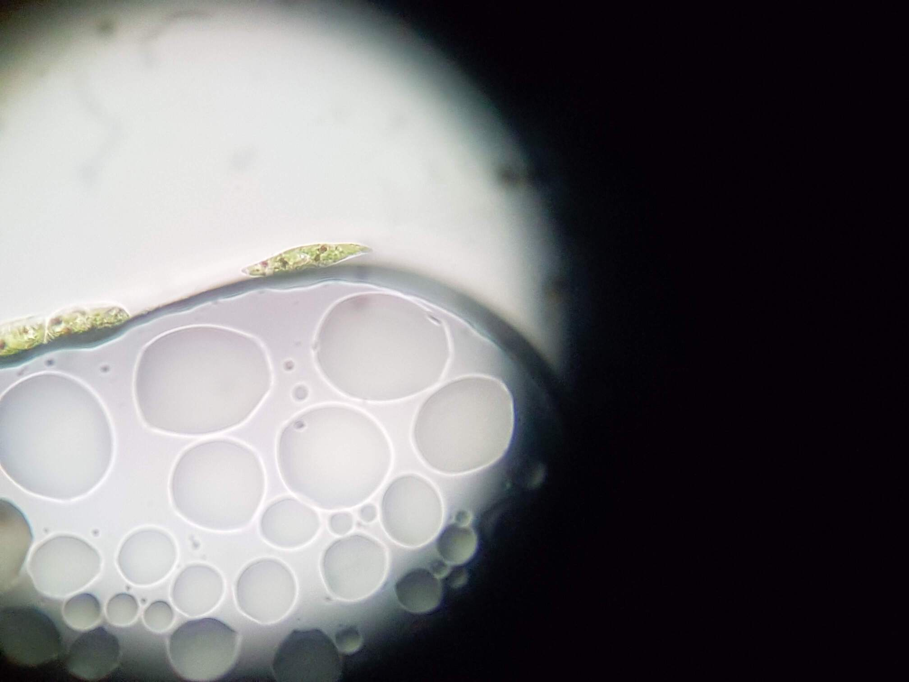

# ProtestsForProtists

Instructions and makefiles for the [ProtestsForProtists](https://lpoolmakefest.org/portfolio/domestic-science-protests-for-protists/) event by [Domestic Science](https://domesticscience.org.uk)

Armed with DIY microscopes count up hidden micro-organisms to protest against bio-diversity collapse in the back of your kitchen cupboard!
  
Learn how to count micro-organism populations and use your camera phone to take and tweet pictures of micro-organisms like yeast and Euglena gracis; a space to talk about bio-diversity at all scales of biological life.

Streaming as and when wifi allows on the [CriticalKits Twitch Stream](https://twitch.tv/criticalkits)

## Requirements

DoES Microscope with 3D printed Adaptor for PiCam v.2.1
PiZero + PiCam
[MakeSpace Live Setup](https://github.com/DynamicDevices/makespacelive)
FoldScope 
